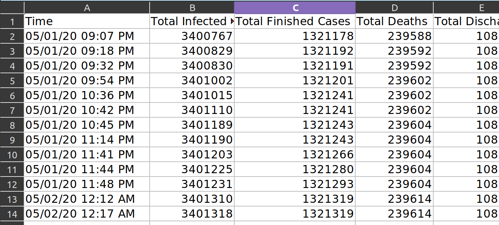

# Coronavirus Monitoring

> ***HTML Requests, Web Scraping, Parsers, Excel interoperability*** 

***TL;DR;*** - This is a program that will monitor different coronavirus statistics and save it to a local excel file.

(Actual Data collected during the Coronavirus Tracker's runtime, collected specifically for the US)

# Synopsis
- Created to determine a trend line for the COVID pandemic, the coronavirus tracker web-scrapes <a href="https://www.worldometers.info/coronavirus/country/us/">this statically-generated website</a> and then saves the scrapped statistics to a local excel file. The user can then use their increasing collection of data points to plot a trend line to determine where on the disease curve we are.
- This was inspired by the phrase "flatten the curve" echoed during the lockdown. Along with the increasing deaths, I wanted to find out whether the worst of the lockdown is yet to come, or if it has already passed.
- This program is cross platform, aside from the notification feature. For full functionality, Windows is preferred.
- Running `coronavirus.py` sends a GET-request to the website, converts that HTML into searchable text with the  BeautifulSoup library (a HTML parser), which is then cataloged to find relevant data. The `openpyxl` library then is used to save the content into `coronavirus_statistics.xlsx`. Finally, the windows-specific library `win10toast` is used to create a notification on the user's desktop with the relevant information.

# Required Libraries:

- threading

- datetime

- soupRequests (part of the respository, webscraping)

- openpyxl (functionality with excel)

- time

- win10toast (creates desktop notifications for Windows)

- append (part of the repository)